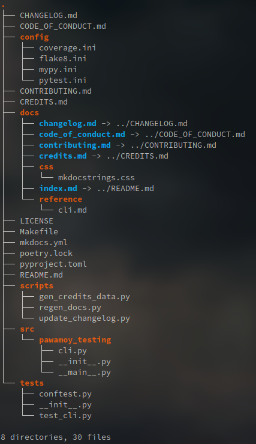

# Copier Poetry

Copier template for Poetry projects.

This copier template is mainly for my own usage,
but feel free to try it out, or fork it!

<!-- logo -->

- [Changelog](CHANGELOG.md)
- [Contributing](CONTRIBUTING.md)
- [Features](#features)
- [License: ISC License](LICENSE)
- [Requirements](#requirements)
- [Generating a project](#generating-a-project)
- [Working on the generated project](#working-on-the-generated-project)
- [Credits](#credits)

## Features

- [Poetry](https://github.com/sdispater/poetry) setup, with pre-defined `pyproject.toml`
- Documentation built with [MkDocs](https://github.com/mkdocs/mkdocs)
  ([Material theme](https://github.com/squidfunk/mkdocs-material)
  and "autodoc" [mkdocstrings plugin](https://github.com/pawamoy/mkdocstrings))
- Pre-configured tools:
  [bandit](https://github.com/PyCQA/bandit),
  [black](https://github.com/psf/black),
  [flake8](https://gitlab.com/pycqa/flake8) and plugins,
  [isort](https://github.com/timothycrosley/isort),
  [mypy](https://github.com/python/mypy),
  [safety](https://github.com/pyupio/safety)
- Tests run with [pytest](https://github.com/pytest-dev/pytest) and plugins, with [coverage](https://github.com/nedbat/coveragepy) support
- Support for GitHub workflow and Gitlab CI
- Python 3.6 or above
- Auto-generated `CREDITS.md` from Python dependencies
- All licenses from [choosealicense.com](https://choosealicense.com/appendix/)
- Makefile for convenience

## Requirements

- [git](https://git-scm.com/downloads)
- [python](https://www.python.org/downloads/)
- [copier](https://github.com/pykong/copier)

I recommend using [`pipx`](https://github.com/pipxproject/pipx)
to install Copier:

```bash
pip install --user pipx
```

## Generating a project

:warning: This template requires Copier features that are not yet
released not merged: [subdirectory](https://github.com/pykong/copier/pull/193)
and [prompt templating](https://github.com/pykong/copier/pull/190).

To try out this template, you'll have to install Copier from my own fork:

```bash
pipx install git+https://github.com/pawamoy/copier.git@_testing
```

And then run Copier normally:

```bash
copier https://github.com/pawamoy/copier-poetry /path/to/your/new/project
```

You can even run it directly (without installing it first) with

```bash
pipx run --spec git+https://github.com/pawamoy/copier.git@_testing \
  copier https://github.com/pawamoy/copier-poetry /path/to/your/new/project
```

## Working on the generated project

The generated project has this structure:



The entry-point is the Makefile:

- `make changelog`: Update the changelog in-place with latest commits.
- `make check`: Run all checks.
- `make check-code-quality`: Check the code quality.
- `make check-dependencies`: Check for vulnerabilities in dependencies.
- `make check-docs`: Check if the documentation builds correctly.
- `make check-types`: Check if the code is correctly typed.
- `make clean`: Delete temporary files.
- `make docs`: Build the documentation locally.
- `make docs-regen`: Regenerate some documentation pages.
- `make docs-serve`: Serve the documentation (localhost:8000).
- `make docs-deploy`: Deploy the documentation on GitHub pages.
- `make help`: Print this help.
- `make format`: Run formatting tools on the code.
- `make release`: Create a new release (commit, tag, push, build, publish, deploy docs).
- `make setup`: Setup the development environment (install dependencies).
- `make test`: Run the test suite and report coverage.
